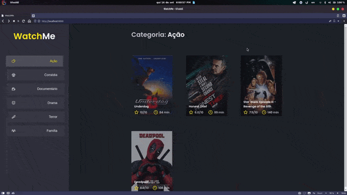

<p align="center">
  <a href="#-tecnologias">Tecnologias</a>&nbsp;&nbsp;&nbsp;|&nbsp;&nbsp;&nbsp;
  <a href="#-projeto">Projeto</a>&nbsp;&nbsp;&nbsp;|&nbsp;&nbsp;&nbsp;
  <a href="#-como-executar">Como executar</a>&nbsp;&nbsp;&nbsp;|&nbsp;&nbsp;&nbsp;
</p>

<br>

<p align="center">

</p
  
<br>
  
## ✨ Tecnologias

Esse projeto foi desenvolvido com as seguintes tecnologias:

- [React JS](https://pt-br.reactjs.org)
- [Sass](https://pt-br.reactjs.org)
- [Typescript](https://www.typescriptlang.org)

## 💻 Projeto

Este projeto exemplifica uma simples navegação entre diferentes categorias de filmes em uma página. Utilizando uma base de dados fake com json-server.
  
## 🚀 Como executar

Clone o projeto e acesse a pasta do mesmo.

```bash
$ git clone https://github.com/CaioAnderson/watch-me-react.git
$ cd watch-me-react
```

Para iniciá-lo, siga os passos abaixo:
```bash
# Instalar as dependências
$ yarn

# Iniciar o servidor
$ yarn server

# Iniciar o projeto
$ yarn dev
```


